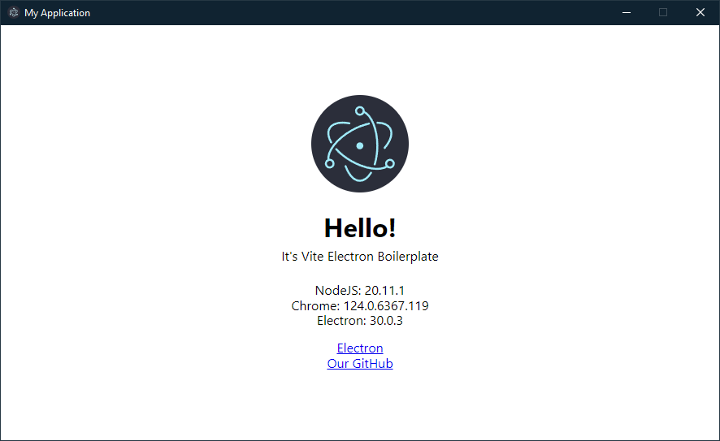

> [!WARNING]
> Support for this template has been discontinued, I recommend using [electron-vite](https://electron-vite.org/) instead.

___
# Vite Electron Boilerplate

Fast development boilerplate for Electron app based on Vite + TypeScript + Sass + Vue/React/Svelte/Vanilla



## Usage

Create a new repository based on this template or just download it. Then customize the template for a specific framework.

All current framework templates can be viewed here: [create-vite](https://github.com/vitejs/vite/tree/main/packages/create-vite)

### To use React:

Install additional dependencies:

```bash
npm i react react-dom
npm i -D @types/react @types/react-dom @vitejs/plugin-react
```

configure electron.vite.config.ts:

import plugin `import react from '@vitejs/plugin-react'`
and set config `plugins: [react()]` in renderer

Example:

```ts
import { defineConfig } from "electron-vite";
import react from "@vitejs/plugin-react";

export default defineConfig({
  main: {},
  preload: {},
  renderer: {
    plugins: [react()],
  },
});
```

download and replace tsconfig.json and tsconfig.node.json from [template-react-ts](https://github.com/vitejs/vite/tree/main/packages/create-vite/template-react-ts)

сonfigure electron-devtools-installer in the `src/main/core/ApplicationWindow.ts` file

make the rest of the settings in the `src/renderer` folder according to the template [template-react-ts/src](https://github.com/vitejs/vite/tree/main/packages/create-vite/template-react-ts/src)

### To use Vue:

Install additional dependencies:

```bash
npm i vue
npm i -D @vitejs/plugin-vue vue-tsc
```

configure electron.vite.config.ts:

import plugin `import vue from '@vitejs/plugin-vue'`
and set config `plugins: [vue()]` in renderer

Example:

```ts
import { defineConfig } from "electron-vite";
import vue from "@vitejs/plugin-vue";

export default defineConfig({
  main: {},
  preload: {},
  renderer: {
    plugins: [vue()],
  },
});
```

download and replace tsconfig.json and tsconfig.node.json from [template-vue-ts](https://github.com/vitejs/vite/tree/main/packages/create-vite/template-vue-ts)

сonfigure electron-devtools-installer in the `src/main/core/ApplicationWindow.ts` file

make the rest of the settings in the `src/renderer` folder according to the template [template-vue-ts/src](https://github.com/vitejs/vite/tree/main/packages/create-vite/template-vue-ts/src)

Don't forget to configure env.d.ts/vite-env.d.ts

### To use Svelte:

Install additional dependencies:

```bash
npm i -D @sveltejs/vite-plugin-svelte @tsconfig/svelte svelte svelte-preprocess tslib
```

configure electron.vite.config.ts:

import plugin `import { svelte } from '@sveltejs/vite-plugin-svelte'`
and set config `plugins: [svelte()]` in renderer

Example:

```ts
import { defineConfig } from "electron-vite";
import { svelte } from "@sveltejs/vite-plugin-svelte";

export default defineConfig({
  main: {},
  preload: {},
  renderer: {
    plugins: [svelte()],
  },
});
```

download and replace tsconfig.json and tsconfig.node.json from [template-svelte-ts](https://github.com/vitejs/vite/tree/main/packages/create-vite/template-svelte-ts)

сonfigure electron-devtools-installer in the `src/main/core/ApplicationWindow.ts` file

make the rest of the settings in the `src/renderer` folder according to the template [template-svelte-ts/src](https://github.com/vitejs/vite/tree/main/packages/create-vite/template-svelte-ts/src)

Don't forget to configure vite-env.d.ts
